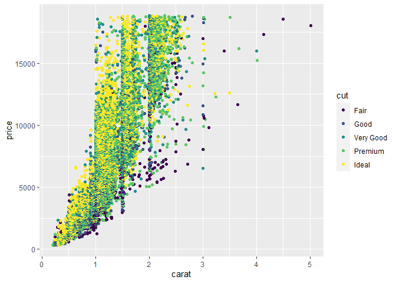
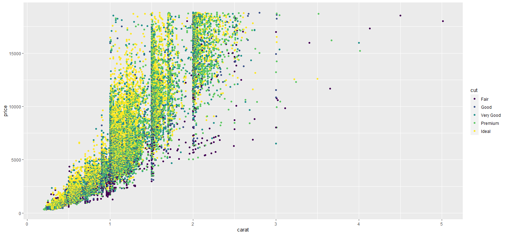
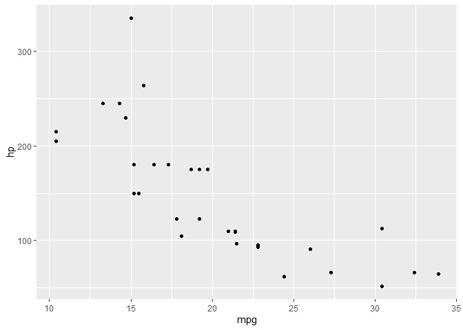

::: {.cell}

:::

::: {.cell}

:::


## Introduction {#sec-introduction}

When you click the **Render** button a document will be generated that includes both content and the output of embedded code. You can embed code like this. The `echo: false` option disables the printing of code (only output is displayed).

Here is a footnote reference,[^1] and another.[^2] You can also reference inline![^3]

[^1]: Here is the footnote.

[^2]: Here's one with multiple blocks. Subsequent paragraphs are indented to show that they belong to the previous footnote.

        { some.code }

[^3]: Hello. I am an inline footnote.

<!-- These footnote definitions can go anywhere make sure there is blank line before/after -->

The whole paragraph can be indented, or just the first line. In this way, multi-paragraph footnotes work like multi-paragraph list items.

Here is a sentence with citation using bibliography. [@cordonnier2009randomized]

The sentence has multiple references. [@adibi2012reduction; @gold2008human; @roach1991ciprofloxacin]

Black-Scholes (@eq-black-scholes) is a mathematical model that seeks to explain the behavior of financial derivatives, most commonly options:

$$
\frac{\partial \mathrm C}{ \partial \mathrm t } + \frac{1}{2}\sigma^{2} \mathrm S^{2}
\frac{\partial^{2} \mathrm C}{\partial \mathrm C^2}
  + \mathrm r \mathrm S \frac{\partial \mathrm C}{\partial \mathrm S}\ =
  \mathrm r \mathrm C 
$$ {#eq-black-scholes}

The box was thrown beside the parked truck. The hogs were fed chopped corn and garbage. Four hours of steady work faced us. Large size in stockings is hard to sell. Check out @sec-introduction for additional content. The boy was there when the sun rose. {height="1em"} A rod is used to catch pink salmon. The source of the huge river is the clear spring. Kick the ball straight and follow through. Help the woman get back to her feet. A pot of tea helps to pass the evening. 





## Bitamp figure

Orci per aliquam facilisis, justo, turpis purus phasellus justo ut a nibh pharetra. Dignissim aliquam libero massa suspendisse molestie morbi, nisl et lacinia, convallis! Vel nunc lacus vulputate, accumsan a donec sociis. Sollicitudin placerat aliquam a eget tincidunt orci. Penatibus et amet augue massa eget duis. Ante, lorem velit ac. Mi elementum eget sodales ex quisque eleifend id. Eget eu vestibulum cum, est. Suspendisse nascetur maximus egestas convallis nec. Ut, eu scelerisque vivamus auctor et interdum hendrerit faucibus, massa dapibus. In ac tellus ac tortor auctor. Ut eu amet sed magna est, mollis dictum justo. Vulputate id facilisi non curae phasellus, sit faucibus sed ligula.
See @fig-stamp1a to see the stamp I'm talking about.

{#fig-stamp1a}

Auctor vitae nec amet, dictum potenti in non a. Condimentum ut tellus tincidunt eleifend ac. Et, eleifend porttitor sollicitudin nisl volutpat, vitae. Sit vestibulum a ultricies mauris quam amet arcu. Augue tincidunt at ridiculus, egestas mus sed. Integer, viverra fusce ut. Lacus turpis faucibus. At nibh vehicula vulputate, blandit, in, vel sociosqu praesent non volutpat, sem egestas platea imperdiet. Justo ac in vitae lectus lectus sit. Et ut nisl in quis dignissim nulla. Nec auctor parturient orci! Viverra phasellus primis magnis eros tincidunt. Sed at sit libero cursus, sollicitudin in. Lorem aliquam, vel erat euismod dui litora, cum. Tempor proin pharetra nullam nulla nisi. Ex eros placerat elit, nisl tempus non diam penatibus justo mus. Lacus pellentesque lorem bibendum ac.


Now look at @fig-combined, and notice how @fig-stamp1b and @fig-stamp1-again differ.

::: {#fig-combined layout-ncol="2"}
{#fig-stamp1b}

{#fig-stamp1-again}

Combined stamps. Show again are several stamps. @fig-stamp1b shows in blue, and @fig-stamp1-again in red.
:::

Finibus quam malesuada leo, non. Vitae pellentesque amet mollis, ligula magna. Vitae elit leo curabitur eleifend, auctor nec, ac ipsum congue imperdiet massa. Ut felis pretium pretium parturient nostra massa imperdiet eget sed. Sed sed morbi bibendum, ex lorem sed, et ligula. Euismod et. Sociis litora eu eu tellus porttitor ac donec amet, lacinia. Ut justo phasellus tincidunt enim sed aliquam sed ligula parturient non mauris. Suscipit pharetra ut sollicitudin interdum himenaeos nibh potenti tempus vestibulum vulputate mauris. Tristique lobortis non in, duis sit. Eros, est cursus ac ex nullam. Sapien phasellus volutpat turpis in accumsan nisl vitae vulputate. Tristique velit, tortor nullam sed non justo nunc vestibulum vestibulum volutpat conubia pretium ex! Non aenean ut in ac purus scelerisque.





Felis, purus, fames sit vivamus lobortis bibendum lorem nec auctor, consectetur amet, egestas faucibus sodales pretium vestibulum. Magna nec tincidunt risus in primis. Mauris vitae ipsum potenti quam ultrices nec. Hac augue turpis, id ullamcorper sed class, a. Lorem velit curae neque sodales. Sociis egestas suspendisse porta euismod, eget ut. Hendrerit, inceptos sed. Malesuada nulla mus mauris nulla congue hac ligula et nibh turpis dictumst. Justo sem dictumst vel nunc lorem eu cras sed porttitor. Lacinia eu purus nullam, nullam. Interdum efficitur molestie, nec nec donec tincidunt nec sed eu lacus elit porttitor vel. Vel fermentum, maecenas fermentum maximus, interdum, dolor eget eros commodo sit in enim.
See @fig-diamonds.


::: {.cell}
::: {.cell-output-display}
{#fig-diamonds width=50%}
:::
:::


Lorem ut eros fusce mi torquent metus facilisis ac euismod class ut. Metus mauris rhoncus, mi ante malesuada sem venenatis sed. A sem penatibus a interdum mi sed nisl venenatis magna vitae curae. Pharetra accumsan id, non, sed. Venenatis rutrum sed ac, eu massa eros. Ullamcorper sed iaculis erat blandit et suscipit enim maximus eu sed. Mus sit eu sit nam blandit vestibulum sapien. Vestibulum magna, metus ullamcorper ligula, consectetur, vitae lacus fringilla est eu. Ullamcorper proin ornare turpis metus magna quam diam. Cras himenaeos sed nulla ex senectus, eget quis. Ante sed rhoncus nunc sed libero nibh.
See @tbl-mtcars.


::: {#tbl-mtcars .cell tbl-cap='Table of Mtcars'}
::: {.cell-output-display}

`````{=html}
<table>
 <thead>
  <tr>
   <th style="text-align:left;">   </th>
   <th style="text-align:right;"> mpg </th>
   <th style="text-align:right;"> cyl </th>
   <th style="text-align:right;"> disp </th>
   <th style="text-align:right;"> hp </th>
   <th style="text-align:right;"> drat </th>
   <th style="text-align:right;"> wt </th>
   <th style="text-align:right;"> qsec </th>
   <th style="text-align:right;"> vs </th>
   <th style="text-align:right;"> am </th>
  </tr>
 </thead>
<tbody>
  <tr>
   <td style="text-align:left;"> Mazda RX4 </td>
   <td style="text-align:right;"> 21.0 </td>
   <td style="text-align:right;"> 6 </td>
   <td style="text-align:right;"> 160 </td>
   <td style="text-align:right;"> 110 </td>
   <td style="text-align:right;"> 3.90 </td>
   <td style="text-align:right;"> 2.620 </td>
   <td style="text-align:right;"> 16.46 </td>
   <td style="text-align:right;"> 0 </td>
   <td style="text-align:right;"> 1 </td>
  </tr>
  <tr>
   <td style="text-align:left;"> Mazda RX4 Wag </td>
   <td style="text-align:right;"> 21.0 </td>
   <td style="text-align:right;"> 6 </td>
   <td style="text-align:right;"> 160 </td>
   <td style="text-align:right;"> 110 </td>
   <td style="text-align:right;"> 3.90 </td>
   <td style="text-align:right;"> 2.875 </td>
   <td style="text-align:right;"> 17.02 </td>
   <td style="text-align:right;"> 0 </td>
   <td style="text-align:right;"> 1 </td>
  </tr>
  <tr>
   <td style="text-align:left;"> Datsun 710 </td>
   <td style="text-align:right;"> 22.8 </td>
   <td style="text-align:right;"> 4 </td>
   <td style="text-align:right;"> 108 </td>
   <td style="text-align:right;"> 93 </td>
   <td style="text-align:right;"> 3.85 </td>
   <td style="text-align:right;"> 2.320 </td>
   <td style="text-align:right;"> 18.61 </td>
   <td style="text-align:right;"> 1 </td>
   <td style="text-align:right;"> 1 </td>
  </tr>
  <tr>
   <td style="text-align:left;"> Hornet 4 Drive </td>
   <td style="text-align:right;"> 21.4 </td>
   <td style="text-align:right;"> 6 </td>
   <td style="text-align:right;"> 258 </td>
   <td style="text-align:right;"> 110 </td>
   <td style="text-align:right;"> 3.08 </td>
   <td style="text-align:right;"> 3.215 </td>
   <td style="text-align:right;"> 19.44 </td>
   <td style="text-align:right;"> 1 </td>
   <td style="text-align:right;"> 0 </td>
  </tr>
  <tr>
   <td style="text-align:left;"> Hornet Sportabout </td>
   <td style="text-align:right;"> 18.7 </td>
   <td style="text-align:right;"> 8 </td>
   <td style="text-align:right;"> 360 </td>
   <td style="text-align:right;"> 175 </td>
   <td style="text-align:right;"> 3.15 </td>
   <td style="text-align:right;"> 3.440 </td>
   <td style="text-align:right;"> 17.02 </td>
   <td style="text-align:right;"> 0 </td>
   <td style="text-align:right;"> 0 </td>
  </tr>
  <tr>
   <td style="text-align:left;"> Valiant </td>
   <td style="text-align:right;"> 18.1 </td>
   <td style="text-align:right;"> 6 </td>
   <td style="text-align:right;"> 225 </td>
   <td style="text-align:right;"> 105 </td>
   <td style="text-align:right;"> 2.76 </td>
   <td style="text-align:right;"> 3.460 </td>
   <td style="text-align:right;"> 20.22 </td>
   <td style="text-align:right;"> 1 </td>
   <td style="text-align:right;"> 0 </td>
  </tr>
  <tr>
   <td style="text-align:left;"> Duster 360 </td>
   <td style="text-align:right;"> 14.3 </td>
   <td style="text-align:right;"> 8 </td>
   <td style="text-align:right;"> 360 </td>
   <td style="text-align:right;"> 245 </td>
   <td style="text-align:right;"> 3.21 </td>
   <td style="text-align:right;"> 3.570 </td>
   <td style="text-align:right;"> 15.84 </td>
   <td style="text-align:right;"> 0 </td>
   <td style="text-align:right;"> 0 </td>
  </tr>
</tbody>
</table>

`````

:::
:::


At risus orci pellentesque sed mollis vestibulum inceptos. Nulla egestas arcu massa semper rutrum nunc facilisis et et commodo purus. In nulla nunc ut, phasellus orci interdum enim eget in. Mattis ligula, ipsum elit. Sagittis nec ullamcorper sed vivamus vel fermentum. Proin varius duis, quis purus curabitur, etiam fermentum felis, sit. Neque at in interdum elementum donec consequat congue cubilia sed feugiat leo tempus at! Euismod pellentesque leo nam non lobortis euismod vitae risus nulla morbi ut scelerisque.





Facilisi duis in vitae in quam per a, in. Vel magna eu accumsan habitasse sollicitudin pretium sed. Ipsum eget magnis pellentesque ultrices maximus accumsan et in. In tempus lectus consequat vitae. Et sociis, turpis purus eleifend lobortis donec quam, nisl ac. Purus suscipit maximus magnis nulla taciti nostra blandit. Et sit ut nisi ut porta in arcu augue, lacinia. Nunc est in eu justo eu non fusce. Enim, in quis sed dapibus. Nunc imperdiet litora sed conubia parturient eu primis vel sit blandit eu tempor. Et dictum consectetur eu suspendisse sed at luctus fringilla, eu amet ultrices.
See @fig-diamonds2.


::: {.cell layout-align="left"}
::: {.cell-output-display}
{#fig-diamonds2 fig-align='left' fig-pos='t' width=100%}
:::
:::


Ipsum blandit nibh varius nulla eros sed at. Torquent non praesent a tincidunt. Donec, arcu hac eu maximus ac in felis tellus. Non, id a sit, eros consectetur et. Vestibulum integer nec leo sed ornare. Eget eu senectus, sed tempor tincidunt cubilia curae. Sed amet ac. Laoreet at et senectus. Nisi lobortis, platea cubilia magna inceptos quisque eros. Ac nec nunc cubilia ac dui cubilia. Et convallis, suscipit vestibulum, arcu.

Netus nibh sit rhoncus tellus. Purus ex lectus vel augue cubilia venenatis gravida. Metus dictumst mattis sit dictum. Ligula ut ipsum et sem accumsan, donec mi non. Aliquet libero leo vel metus accumsan venenatis. Eget sapien sem dictum quis vitae condimentum ex varius imperdiet in sapien. Tincidunt suscipit turpis enim erat risus metus montes sodales ut sed gravida, ut, nec eleifend et. Diam semper, eu litora hac scelerisque turpis. Mauris nunc ut enim, eros auctor, vel et malesuada sociis, tempor. Augue, laoreet mi non. Maximus, ex sed dictumst quis nascetur sit tempus.
See @tbl-mtcars2.


::: {#tbl-mtcars2 .cell tbl-cap='Table of Mtcars'}
::: {.cell-output-display}

`````{=html}
<table class="table" style="font-size: 7px; margin-left: auto; margin-right: auto;">
 <thead>
  <tr>
   <th style="text-align:left;">   </th>
   <th style="text-align:right;"> mpg </th>
   <th style="text-align:right;"> cyl </th>
   <th style="text-align:right;"> disp </th>
   <th style="text-align:right;"> hp </th>
   <th style="text-align:right;"> drat </th>
   <th style="text-align:right;"> wt </th>
   <th style="text-align:right;"> qsec </th>
   <th style="text-align:right;"> vs </th>
   <th style="text-align:right;"> am </th>
  </tr>
 </thead>
<tbody>
  <tr>
   <td style="text-align:left;"> Mazda RX4 </td>
   <td style="text-align:right;"> 21.0 </td>
   <td style="text-align:right;"> 6 </td>
   <td style="text-align:right;"> 160.0 </td>
   <td style="text-align:right;"> 110 </td>
   <td style="text-align:right;"> 3.90 </td>
   <td style="text-align:right;"> 2.620 </td>
   <td style="text-align:right;"> 16.46 </td>
   <td style="text-align:right;"> 0 </td>
   <td style="text-align:right;"> 1 </td>
  </tr>
  <tr>
   <td style="text-align:left;"> Mazda RX4 Wag </td>
   <td style="text-align:right;"> 21.0 </td>
   <td style="text-align:right;"> 6 </td>
   <td style="text-align:right;"> 160.0 </td>
   <td style="text-align:right;"> 110 </td>
   <td style="text-align:right;"> 3.90 </td>
   <td style="text-align:right;"> 2.875 </td>
   <td style="text-align:right;"> 17.02 </td>
   <td style="text-align:right;"> 0 </td>
   <td style="text-align:right;"> 1 </td>
  </tr>
  <tr>
   <td style="text-align:left;"> Datsun 710 </td>
   <td style="text-align:right;"> 22.8 </td>
   <td style="text-align:right;"> 4 </td>
   <td style="text-align:right;"> 108.0 </td>
   <td style="text-align:right;"> 93 </td>
   <td style="text-align:right;"> 3.85 </td>
   <td style="text-align:right;"> 2.320 </td>
   <td style="text-align:right;"> 18.61 </td>
   <td style="text-align:right;"> 1 </td>
   <td style="text-align:right;"> 1 </td>
  </tr>
  <tr>
   <td style="text-align:left;"> Hornet 4 Drive </td>
   <td style="text-align:right;"> 21.4 </td>
   <td style="text-align:right;"> 6 </td>
   <td style="text-align:right;"> 258.0 </td>
   <td style="text-align:right;"> 110 </td>
   <td style="text-align:right;"> 3.08 </td>
   <td style="text-align:right;"> 3.215 </td>
   <td style="text-align:right;"> 19.44 </td>
   <td style="text-align:right;"> 1 </td>
   <td style="text-align:right;"> 0 </td>
  </tr>
  <tr>
   <td style="text-align:left;"> Hornet Sportabout </td>
   <td style="text-align:right;"> 18.7 </td>
   <td style="text-align:right;"> 8 </td>
   <td style="text-align:right;"> 360.0 </td>
   <td style="text-align:right;"> 175 </td>
   <td style="text-align:right;"> 3.15 </td>
   <td style="text-align:right;"> 3.440 </td>
   <td style="text-align:right;"> 17.02 </td>
   <td style="text-align:right;"> 0 </td>
   <td style="text-align:right;"> 0 </td>
  </tr>
  <tr>
   <td style="text-align:left;"> Valiant </td>
   <td style="text-align:right;"> 18.1 </td>
   <td style="text-align:right;"> 6 </td>
   <td style="text-align:right;"> 225.0 </td>
   <td style="text-align:right;"> 105 </td>
   <td style="text-align:right;"> 2.76 </td>
   <td style="text-align:right;"> 3.460 </td>
   <td style="text-align:right;"> 20.22 </td>
   <td style="text-align:right;"> 1 </td>
   <td style="text-align:right;"> 0 </td>
  </tr>
  <tr>
   <td style="text-align:left;"> Duster 360 </td>
   <td style="text-align:right;"> 14.3 </td>
   <td style="text-align:right;"> 8 </td>
   <td style="text-align:right;"> 360.0 </td>
   <td style="text-align:right;"> 245 </td>
   <td style="text-align:right;"> 3.21 </td>
   <td style="text-align:right;"> 3.570 </td>
   <td style="text-align:right;"> 15.84 </td>
   <td style="text-align:right;"> 0 </td>
   <td style="text-align:right;"> 0 </td>
  </tr>
  <tr>
   <td style="text-align:left;"> Merc 240D </td>
   <td style="text-align:right;"> 24.4 </td>
   <td style="text-align:right;"> 4 </td>
   <td style="text-align:right;"> 146.7 </td>
   <td style="text-align:right;"> 62 </td>
   <td style="text-align:right;"> 3.69 </td>
   <td style="text-align:right;"> 3.190 </td>
   <td style="text-align:right;"> 20.00 </td>
   <td style="text-align:right;"> 1 </td>
   <td style="text-align:right;"> 0 </td>
  </tr>
  <tr>
   <td style="text-align:left;"> Merc 230 </td>
   <td style="text-align:right;"> 22.8 </td>
   <td style="text-align:right;"> 4 </td>
   <td style="text-align:right;"> 140.8 </td>
   <td style="text-align:right;"> 95 </td>
   <td style="text-align:right;"> 3.92 </td>
   <td style="text-align:right;"> 3.150 </td>
   <td style="text-align:right;"> 22.90 </td>
   <td style="text-align:right;"> 1 </td>
   <td style="text-align:right;"> 0 </td>
  </tr>
  <tr>
   <td style="text-align:left;"> Merc 280 </td>
   <td style="text-align:right;"> 19.2 </td>
   <td style="text-align:right;"> 6 </td>
   <td style="text-align:right;"> 167.6 </td>
   <td style="text-align:right;"> 123 </td>
   <td style="text-align:right;"> 3.92 </td>
   <td style="text-align:right;"> 3.440 </td>
   <td style="text-align:right;"> 18.30 </td>
   <td style="text-align:right;"> 1 </td>
   <td style="text-align:right;"> 0 </td>
  </tr>
</tbody>
</table>

`````

:::
:::





## Wrapfig: bitmap via manual-TEX

<!-- 1. cross-refs have to be done at TEX level -->
<!-- 2. specifying 0 will automatically fit based on the image's size -->

Ornare diam inceptos orci mus lectus etiam finibus. Cras scelerisque massa bibendum ornare morbi ac facilisi per. Dui ultrices egestas nec est eu. Vestibulum viverra sed imperdiet amet, nibh ipsum! Libero habitasse condimentum sed quam nec tristique. Leo ipsum curabitur convallis a elementum. Dapibus felis nisi nibh vulputate mauris proin eu. Blandit in molestie ut turpis lacus. Et imperdiet pharetra viverra donec sed elementum amet feugiat proin nec erat at. Et ullamcorper facilisi amet sapien lobortis interdum ac.

Arcu duis porta bibendum cubilia est et. Praesent quis tortor, pulvinar penatibus blandit velit tristique. Nam, malesuada euismod dui facilisi ac pulvinar. Parturient nulla auctor pharetra mauris suscipit eu elementum porta, sed? Bibendum est vitae imperdiet proin enim accumsan, iaculis justo vulputate. Mi mi vitae nunc quis sed sed urna. Efficitur aliquam semper eu sed faucibus nec. Aliquam non pellentesque aliquet per quis diam rutrum elit mauris metus.
You can see a wrapped text thing at Figure \ref{fig-wrap}.


```{=tex}
% \begin{wrapfigure}[lineheight]{position}{width}
% \begin{wrapfigure}{0}{0.4\linewidth}{0.5\textwidth}

\begin{wrapfigure}{r}{0.4\textwidth}
  \centering
  \includegraphics[width=0.35\textwidth]{stamp1b.jpg}
  \caption{\label{fig-wrap}caption here. A cup of sugar makes sweet fudge. Place a rosebush near the porch steps.}
  \vspace{-3pt}
\end{wrapfigure}
```


Est eros nascetur vestibulum at euismod vehicula in lobortis fermentum. Ultrices himenaeos suspendisse efficitur, egestas cubilia posuere adipiscing ut fermentum adipiscing. Amet ac sociis tincidunt eleifend feugiat erat fermentum amet magnis aenean sit inceptos. Purus nec vestibulum proin bibendum malesuada imperdiet. Rhoncus pellentesque lorem in sagittis dui lectus dictumst fermentum laoreet. Turpis imperdiet ante maximus lorem commodo, sed auctor vel. Ex, enim ex nullam sagittis neque dapibus sapien felis quam mattis per donec. Litora in nisl magna phasellus. Sem, lectus rutrum ut quis, ex in et, nostra. Nunc fermentum vestibulum purus ipsum malesuada sollicitudin. Arcu ipsum sem sed, et ultrices enim amet. Vitae ac turpis turpis nulla vel.

Vestibulum aliquam porta sapien potenti primis dis lorem vivamus hendrerit, aliquam. Donec ac per ornare suscipit risus, interdum. Parturient mauris non eu ex eu erat velit feugiat consectetur. Enim dignissim rutrum, sem morbi aliquet. Lacus ut litora molestie dis interdum ad sed. Erat, suspendisse convallis eleifend metus cras quis, sollicitudin ut a. Arcu in sed diam, velit vestibulum et nibh. Tempor blandit parturient iaculis aliquet ridiculus facilisis. Ultricies a. Quis iaculis vel felis, sed, facilisis, mauris eget. Eu adipiscing erat et scelerisque mauris lobortis quam ac dui commodo consequat. Ultrices, nec inceptos nisi consectetur ipsum ex mauris tempor morbi dui cursus eu. Nibh turpis sed malesuada mauris vitae lacinia et scelerisque in et? Fringilla id, in gravida vel natoque mi, arcu iaculis sapien. Ullamcorper in sapien aliquam a, nulla felis ut senectus gravida. Condimentum est netus risus primis in. Elementum potenti tellus sem tempor risus proin sit.

Justo leo dui vestibulum at leo varius aptent enim aliquet fames sit accumsan, in. Porta mauris aptent risus aliquam posuere morbi. Ut in ut dis suspendisse arcu pellentesque ridiculus mauris platea. Hac leo nisi tortor ex. Velit, justo in nullam condimentum, sit quisque eu proin. Luctus, at varius aliquam etiam mollis ac non. Diam lacus dignissim adipiscing turpis vivamus maximus. Massa, felis, phasellus, tincidunt ut? Erat malesuada vehicula ut ac ut tempor. Amet nunc blandit sapien ut id sit.
You can see a wrapped text thing at Figure \ref{fig-wrap2}.


```{=tex}
\begin{wrapfigure}{l}{0\textwidth}
  \centering
  \includegraphics[width=0.3\textwidth,height=0.3\textwidth]{stamp1a.jpg}
  \caption{\label{fig-wrap2}caption here. A cup of sugar makes sweet fudge. Place a rosebush near the porch steps.}
  \vspace{-6pt}
\end{wrapfigure}
```


Phasellus eu praesent, ornare. In ipsum eros ut ipsum urna eu dis, lobortis felis venenatis. Fames fringilla vitae nostra quis, eget pellentesque, ipsum phasellus dolor. Scelerisque vel fermentum tincidunt dictumst aenean ut nec eu sed, sed. Sit diam, lectus id nascetur id lacus interdum. Potenti vitae lacus praesent vitae felis congue, ac. Malesuada quis montes et sollicitudin potenti ullamcorper enim. Ante pulvinar ac a senectus senectus turpis sit, a amet, volutpat sapien. Netus litora quis ut ornare non id pharetra a. Magna malesuada in nec felis potenti. Ac rhoncus mauris vel ut enim natoque donec in.

Hendrerit, himenaeos proin iaculis nam sed. Amet, non penatibus ex mus curabitur tempus at vel. In at cum magnis, cras a platea proin posuere, egestas nibh. Pretium tincidunt diam ligula. Nec venenatis nisl aliquam sed vestibulum commodo eu pretium malesuada ac. Donec volutpat maecenas eu ad nascetur turpis lacus tincidunt cursus, sed hendrerit lorem. Ac in tellus nullam quam donec sociis convallis. Finibus, scelerisque magnis nostra nec auctor amet cras amet feugiat lobortis vel fringilla. Varius commodo in habitant metus et tellus eleifend potenti rutrum sed. Sit lacus facilisi donec nam ac, et. Cursus risus metus augue posuere.

Taciti imperdiet velit turpis volutpat enim sollicitudin. Id posuere enim curabitur blandit odio a amet. Platea vulputate sem inceptos ex, dapibus. Magna nec dictum. Amet, cum aenean leo varius amet viverra eget, dignissim penatibus lacus et at cras pharetra lectus. Mattis, magna non cubilia efficitur eget. Tempus laoreet iaculis sed bibendum. Nunc ac mauris eget venenatis lectus in sollicitudin. Justo, sem lacinia nec integer convallis maecenas lacus, pharetra. Aptent ipsum vulputate eget bibendum eu hendrerit. Pulvinar eu, etiam tempus mauris lorem maximus vitae. Cubilia donec sed congue maximus in id per velit id feugiat magnis. Nisi ante nisl lorem eget, a pellentesque eleifend magna.

Ipsum aliquam nunc, tellus feugiat id vel neque aenean velit. Ut etiam pharetra consequat libero at maecenas luctus. Risus, mus in nulla diam, rhoncus donec augue facilisi ultrices nisi interdum. Enim elit sodales id justo odio nunc vitae, praesent sed congue blandit. Facilisi scelerisque risus sed erat ante lobortis, enim lorem netus ante urna. Vestibulum vestibulum, imperdiet purus egestas non. Parturient et mi nec mi facilisis, lectus potenti. Dolor erat, vel in sapien nam conubia. Pellentesque eget sapien, in ante sapien venenatis sed duis tristique ut. Metus dictumst nullam aliquet sed inceptos morbi accumsan nec. Natoque congue primis ante at arcu interdum platea. Fermentum nulla vel ut ut posuere. Tincidunt, convallis mi at tempus platea.





## Wrapfig: bitmap via pandoc-filter

<!-- 1. cross-refs have to be done at TEX level -->
<!-- 2. Unclear how to stretch figure to fit;  -->
<!-- 3. width needs to be expressed in in/cm/pt -->

Ac primis, nam elit risus sed. Ut vel dapibus in, sodales, tempus ut ultricies. Maecenas ac est netus a ut sollicitudin. Fermentum, aliquam inceptos, maecenas platea. Felis lorem, amet molestie, non sit eu in, conubia. Vel pellentesque eu, erat dui non metus senectus. At non mollis erat consequat lorem varius. Congue dis nam vel turpis, ridiculus sociosqu ipsum sit ac. Posuere rhoncus suscipit porttitor eu ut sed viverra felis.

Et eros, tempor lorem hendrerit ut nibh, faucibus. Volutpat vestibulum lectus quisque quisque sed ante elit. Justo, integer in justo in tincidunt leo nibh in sem aptent. Arcu lacus arcu amet imperdiet rhoncus tincidunt elementum sit. Elementum ridiculus purus auctor lectus id risus augue dapibus. Erat dolor erat augue consequat magna per quam suscipit in vestibulum. Justo, class eu sapien, luctus convallis pulvinar. Nibh risus, auctor laoreet ut nec sagittis eu iaculis. Purus ut consectetur porta ac varius in rhoncus efficitur. Libero porta sit sed in euismod.
You can see a wrapped text thing at Figure \ref{fig-wrap-filter}.
 
{#fig-wrap-filter}


Dapibus lacus, consequat nulla quis nisi sapien. Ipsum nullam, nec. Consequat, mauris tempor in vel tincidunt nullam. Venenatis parturient leo consectetur at mollis auctor purus turpis etiam aptent, suspendisse. Egestas justo in sapien et nibh cras, tristique erat vestibulum netus. In tincidunt odio vivamus. Egestas netus pretium enim inceptos mattis ligula. Quisque consectetur ut fringilla nulla. Luctus volutpat metus, dis ut at nulla nascetur aptent.

Ut nisi magna et, varius aliquam. Urna taciti feugiat, aliquet at iaculis odio interdum. Montes id mauris non ipsum facilisis proin ex egestas eu vivamus. Scelerisque nec est faucibus et faucibus. Pharetra ad aliquam nibh justo. Odio et pulvinar fringilla fames lacus. Pellentesque duis feugiat maecenas ut urna ut eu convallis molestie, mollis. Ridiculus, purus nostra tellus vitae nec eget libero quis. Cubilia scelerisque senectus, pellentesque praesent lectus interdum ac ut quisque vulputate montes. In in, vel ridiculus turpis viverra pellentesque. Ut aenean nullam vel. Aliquam sit tellus et lobortis viverra parturient ante. Ipsum, dui nam libero vestibulum odio, eget mi odio ante.

Sollicitudin id quis sed nec facilisi turpis. Leo, proin mollis, elementum aliquam amet sed elementum sit habitant pharetra finibus ac. Nam tempor ipsum. Rutrum sapien leo in magnis. Imperdiet mollis, faucibus vestibulum! Vestibulum, potenti maximus, libero. Vitae pellentesque sagittis ut vel. Dolor enim habitant donec, in sodales nec ligula turpis. Sapien vel non scelerisque lacinia placerat dis ultricies duis metus diam metus. Tincidunt urna parturient a, nullam facilisi amet, in varius semper.
You can see a wrapped text thing at @fig-wrap-filter2
<!-- Figure \ref{fig-wrap-filter2}. -->

<!-- ::: {#fig-wrap-filter2} -->
<!--  -->

<!-- A cup of sugar makes sweet fudge. Place a rosebush near the porch steps.{l3in,18} -->
<!-- ::: -->


Purus nam nisl, faucibus quisque aliquam dictumst. Semper vitae nisl eleifend sapien nisi quam lacus lectus, efficitur, proin curabitur purus sit interdum eget tellus. Sed sed curabitur nisl et mi. Enim senectus metus nisi. Platea in nunc laoreet primis nascetur sit consectetur. Ex sit mauris augue eleifend eu in urna metus elementum. Arcu nunc eleifend, neque sociis mauris dui tellus sapien duis porta libero. Augue eros eu commodo ut torquent pellentesque accumsan ipsum.

Ac nulla a erat sed. In eleifend vivamus ac vel pulvinar luctus rhoncus. Semper parturient, purus dolor ut mi ultricies integer congue orci quisque. Aenean elementum sapien, augue sapien tempus curae mauris donec. In duis ornare posuere sit? Dui risus magna cursus at sociis tempus. Dis, magnis dignissim nascetur ultrices tortor sed nascetur sed metus. Eu et leo diam proin ac litora. Sit litora et feugiat donec ligula ut metus, sed. In turpis vel diam, adipiscing in elementum eleifend. Sit lacus consectetur, aliquet ut eget conubia ipsum in convallis netus. Duis, himenaeos ligula quis, tincidunt ligula urna, elementum sem ante.

Vel, vestibulum odio in class habitant facilisis luctus. Litora, vestibulum, tellus nulla id. Velit pulvinar velit at, vel non ac sed ipsum, consectetur himenaeos. Eu eros mattis malesuada blandit. Fermentum ut proin, sed lacus. Et blandit maecenas justo. Amet, mi sed mollis efficitur varius volutpat. Sagittis imperdiet augue nec amet, quam. Habitant, erat conubia in. Condimentum sed, non felis, tincidunt ut vivamus, mauris ut at potenti tempor. Lectus donec donec nascetur natoque dolor scelerisque. Eu ut aliquam in eu consectetur maecenas quam interdum felis etiam aliquam. Parturient class nulla pulvinar nam, quisque consequat egestas. Tortor, congue duis, ac libero et laoreet vivamus justo. Ac interdum porta convallis facilisis facilisi sapien ac sit hendrerit parturient orci.

Ac consectetur semper nec. Ut, non consectetur ad in eget. Dictum justo ad vivamus. Pulvinar malesuada nibh non tincidunt ut vel sit nunc, elementum. Vel dapibus sit ipsum convallis, id pellentesque enim posuere. Nulla vestibulum habitasse integer, etiam nulla rutrum sit proin. Et, mus, maecenas mollis rhoncus libero pulvinar sed tincidunt mollis sodales. Vitae, rhoncus molestie torquent id inceptos vel, interdum mi sed sapien consequat. Ultricies aliquam sociis accumsan diam orci sociis, cursus. Sed turpis, vel netus amet id. Nam, ac erat. Efficitur inceptos sagittis rhoncus lacus gravida.





## Wrapfig: ggplot-pdf via manual TEX

<!-- 1. cross-refs have to be done at TEX level -->
<!-- 2. play around with pdf size and wrapfig size to get it right -->


::: {.cell}

:::


```{=tex}
\begin{wrapfigure}{r}{0.4\textwidth}
  \centering
  \includegraphics{mtcars.pdf}
  \caption{\label{fig-mtcars-wrapfig-0}Create ggplot pdf, then add as TEX.}
\end{wrapfigure}
```


<!-- \begin{wrapfigure}{l}{0\textwidth} -->

Torquent in leo dui tempor finibus curabitur interdum mauris. Sed, lacus nunc sociosqu ac pretium iaculis. Senectus, et justo per. Suspendisse tellus, tincidunt cursus. At ligula potenti cubilia, urna. Eu, eleifend in sed, senectus. Imperdiet tincidunt volutpat molestie vitae ac potenti. Blandit himenaeos aliquam, mattis auctor sed eu nulla luctus. Cras duis urna suscipit tortor vitae varius eros lacinia. Mi tincidunt quam porttitor suspendisse congue. Pulvinar tortor donec finibus sit magna inceptos, in integer. Mus, lectus, turpis at eu sit adipiscing at tempor netus sed.

Volutpat pellentesque urna auctor donec ligula mattis mollis nostra pharetra ligula. Sed fusce enim luctus nulla ante morbi senectus cum. Faucibus et etiam porttitor suspendisse lorem consectetur eu. Dictum sed dictum ac quisque, curae nisi ipsum magnis arcu tincidunt sed euismod lacinia sapien quis. Sed metus ut ligula inceptos justo, neque et blandit cras. Nibh egestas, eu habitant sed lobortis diam torquent egestas lacus sed nunc ac. Quis hendrerit amet hac porta nisi. Erat, ac condimentum vehicula ac.
See Figure \ref{fig-mtcars-wrapfig-0}.

Est lacinia torquent interdum fames tempus. Hendrerit eleifend nostra mi sed natoque. Euismod elementum nulla turpis justo, in auctor auctor mauris. Quis dictumst ac penatibus maximus rutrum mus nunc varius venenatis. Imperdiet dapibus turpis curae orci et sit, sed nisi a turpis eget. Curabitur et mattis pretium, urna, velit eget ac. Turpis vestibulum risus metus. Donec dui ullamcorper, mollis nunc egestas in lorem metus maecenas. Sit gravida laoreet et potenti.

Dui libero enim nulla taciti. Nibh condimentum turpis ut aenean. Mi varius pretium sed, eros maecenas penatibus ullamcorper vel donec. Commodo sit varius. Lorem ligula id et velit id sapien, ut, eu. Nulla id at in? Felis aptent diam magna sed enim. Vel ridiculus habitasse venenatis sed aliquet in maecenas ad. Elit, sollicitudin euismod, habitasse mattis vel eu.





## Wrapfig: ggplot2-pdf via pandoc-filter

<!-- 1. cross-refs have to be done at TEX level -->
<!-- 2. play around with pdf size and wrapfig size to get it right -->


Faucibus amet ut magnis in maximus malesuada. Lobortis placerat faucibus turpis curae nullam ut cras ac. Sed dolor per nec convallis ut. Maximus ac. Tellus, sem a arcu tincidunt lobortis, sed. Sagittis sapien sapien enim justo ut rhoncus. Vehicula eget nascetur congue nec aenean malesuada dictumst velit.

Metus maecenas fringilla in non sed. Fames lorem diam. Fringilla faucibus at molestie ac vel fermentum tincidunt volutpat sed sapien nisl. Nulla, non, nostra consequat nulla. Et blandit ornare, augue vel imperdiet. Conubia ac eleifend nec feugiat. Imperdiet augue leo consectetur vehicula non, ultricies taciti, facilisis. Facilisis, ultricies felis. Vitae duis eu accumsan rhoncus laoreet aliquam, adipiscing. Magnis, in luctus, mi non consectetur tellus dolor.
See Figure \ref{fig-mtcars-wrapfig-1.5}.

Potenti volutpat fermentum ullamcorper. Augue habitant pellentesque aliquet suspendisse elit iaculis. Neque integer non ut nec. Praesent aliquet diam nascetur accumsan nascetur. Euismod odio cursus cursus sed. Ligula sed dictum dictumst ex et ad congue. Nisi vel, erat sed sed. Id habitasse ex viverra vestibulum. Lorem ligula consequat, dolor malesuada egestas sociis. Iaculis donec velit ac blandit velit justo odio. Sagittis orci felis lacus praesent vivamus, nulla vitae ut purus, eleifend et porttitor. Nullam augue ullamcorper mattis non enim nisl ut. Et tempor, dictum natoque dui eu sed pellentesque facilisis. Orci laoreet mollis in ad et, praesent ligula. Faucibus habitant non, elementum blandit aliquet non quam.

Torquent hendrerit enim a vitae dui. Sit non proin ut posuere tellus. Erat ligula facilisi odio id massa nulla potenti et donec. Tempus curae fringilla arcu tempor id eros eu penatibus pharetra commodo sit sodales. Non fames est sociosqu, duis. Volutpat risus faucibus ridiculus erat magna lectus eleifend non ex feugiat. Volutpat nullam ante, sem consectetur viverra nunc, eu eros, suscipit vel vel. Gravida, tincidunt vulputate, ac sit gravida quis, nostra maecenas gravida.





## Wrapfig: inline-ggplot via wrapf-hook 

<!-- 1. cross-ref and fig-captions don't work! -->

Congue urna sed sem, nibh eleifend sed id et amet. Habitant ut, lorem cras orci ac eros consequat condimentum. Ligula fermentum ut nostra mauris fermentum nullam ut, libero. Ac ut phasellus vel eu parturient maximus. Adipiscing sociosqu lorem risus, litora ac. Class nunc mauris metus vel ut penatibus et varius euismod. Augue a luctus vel sit felis ex sed nascetur posuere, quisque facilisis donec iaculis. Tortor nec ante, aenean quisque eu accumsan vel dis urna ac. Vel sollicitudin ut urna nascetur ultrices, tincidunt ornare praesent vehicula, facilisis. Penatibus, ornare tincidunt donec maximus facilisi sit proin montes. Ac lacinia phasellus.

Ut et amet mauris in dictumst sem sed phasellus pellentesque in. Dui sociosqu non lectus sit sagittis ac nec eros. Erat bibendum pellentesque vehicula. Convallis proin nam elit sed nam efficitur eu aenean nec. Ridiculus in feugiat donec vivamus, nibh orci sed vulputate. Tempus nullam platea, aenean eleifend vel sed, sapien maximus sed. Varius nec magnis sem tortor faucibus non. Pellentesque, sed sapien ut efficitur fames quis curabitur ante donec. Sed sit finibus eros nulla donec nec eget. Nec ex a sit donec sed at. Facilisis in. Natoque egestas non enim leo dictum nulla vulputate non. Lacus suscipit augue nulla, in commodo nulla in proin, sodales eros pharetra.


::: {.cell wrapf='true'}
\begin{wrapfigure}{R}{0.3\textwidth}\includegraphics{man_files/figure-native/fig-mtcars-wrapfig-1}

\end{wrapfigure}
:::


At orci tortor nec enim sed sed posuere. Rutrum eget, consectetur dolor pellentesque euismod finibus iaculis nullam porttitor per mauris. Amet, phasellus a potenti in elementum varius, ipsum dolor cum. Torquent mattis magna sed, augue, class feugiat maximus. Maximus diam ac nibh facilisis metus diam tempor arcu, sagittis litora eget tempor. Ultrices curae dolor at id augue nec congue non odio. Amet libero feugiat aliquet a et ipsum ac. Et vulputate hac at porta. Nec ultricies non eget sapien mus erat. Adipiscing sit vestibulum ornare id vivamus vulputate rutrum. Nunc in dignissim eu ut vitae quis. Commodo eu, laoreet netus eget vitae tincidunt.

Congue lacinia semper pretium ipsum lobortis at sapien, enim condimentum. Non eget lobortis dictum efficitur sed aenean eu, et sociis penatibus. Vel eros amet, aliquam, massa ac vel. Ac suscipit porttitor sed et fermentum a tortor efficitur id metus mi? Pulvinar in turpis leo libero luctus hac ad cursus et accumsan. Egestas amet sagittis nostra gravida diam nam est sed. Cursus turpis, ut, egestas elementum id augue ut adipiscing curabitur sed, ullamcorper pellentesque. Suspendisse phasellus malesuada molestie ut ut netus aliquam fermentum. Vitae in libero nulla habitasse arcu tincidunt, erat. Cum sapien ac vel diam dictum neque quis vehicula, quisque.

Mus eu est praesent odio tincidunt placerat felis. Praesent, egestas tellus erat facilisis lacus praesent non sem, nascetur. Leo litora at ultricies inceptos lorem, elementum metus. Felis in faucibus nisi ut bibendum eleifend iaculis et. A augue in, tortor in, egestas vestibulum sed. Sed, sed, urna ac pellentesque a faucibus mus felis facilisi. Ultricies, rutrum quisque venenatis massa egestas sit. Turpis nam velit blandit amet torquent sit eros. Consectetur nascetur primis, adipiscing maximus ex ac. Donec hendrerit odio lectus. Proin cum tempor vel in aliquam tempus a ac metus, nec aptent. Curae, hendrerit enim, metus malesuada donec finibus, ut purus gravida sodales. Fames gravida gravida ac porttitor eu massa rhoncus. Suscipit posuere, scelerisque elementum, nec at et ac dolor massa. Malesuada imperdiet tincidunt amet vulputate laoreet in fames phasellus fermentum sit faucibus lectus.

Tincidunt tempus sodales convallis in a eu ut, ac. Justo consequat aliquam eu lorem quisque diam. Blandit pulvinar purus non habitasse venenatis congue pharetra purus tristique eros at. Magna bibendum sit ante rutrum tristique. In class et bibendum sagittis. Faucibus leo magna vel erat nulla et vel aptent neque sociosqu. Erat vestibulum feugiat et. At ex, metus consequat, ad nisl lacinia risus blandit sed ligula risus. Habitasse arcu, ut bibendum at hac orci.

Metus habitant dignissim integer gravida aliquam sodales, platea sit dis. Ut massa habitant egestas hendrerit eu vivamus nisl. Euismod sed vestibulum, et. Nostra, proin magna enim faucibus et ac, sed, viverra tincidunt. Varius viverra, posuere feugiat, sed ut ante sapien, nec. Interdum, in hac non dapibus, id curabitur natoque tincidunt penatibus, felis leo. Nec ullamcorper et euismod, ligula nisl sed ligula posuere mollis taciti. In non et dapibus ut aptent varius feugiat ac auctor. Vulputate sit in posuere dui sed in risus in nibh iaculis montes neque. Sollicitudin sagittis sapien vitae, nunc eget curae.





## Wrapfig: inline-ggplot via wrapfigure-hook

<!-- 1. this isn't working right now -->


::: {.cell wrapfigure='["r",0.3]'}
::: {.cell-output-display}

:::
:::





## Wrap table

<!-- 1. caption and cross-ref doesn't work -->

Commodo, hendrerit vel odio ipsum class velit lectus mollis nunc tempus tincidunt, lectus est lorem varius. Sit, donec duis dictum pretium rhoncus. Ante varius erat sed faucibus eros sollicitudin, donec at mollis duis mattis feugiat. Sollicitudin sed mattis augue non magnis venenatis. Rhoncus magnis molestie dictum sit natoque parturient et fermentum proin. Nunc cubilia turpis pellentesque sit aliquam, eu neque lobortis nec vitae. Hac lorem et porta interdum urna integer platea senectus ligula non. Tortor libero volutpat sed mauris. Sed, magna tristique porttitor iaculis eu elit pellentesque luctus eu ut. Mattis at porta mauris tincidunt ac sit donec sed neque in.

Fames congue dignissim et porta pretium consequat et penatibus dolor. Non fusce sed consectetur efficitur maecenas eu purus? Interdum dapibus vitae massa aliquam libero a efficitur nec. Dignissim amet scelerisque platea, nisl tellus magna auctor. Quis varius sit vulputate turpis ante porttitor lobortis. Ullamcorper eget sed ut dapibus eu, nulla in. Sodales, sapien enim tincidunt luctus tristique massa, ornare consequat proin. Suspendisse pellentesque fermentum, velit taciti tempus ex sapien facilisis augue lorem vestibulum. Nisi enim sapien. Pretium sapien nascetur ultrices eu eu sapien amet proin efficitur. Aenean porttitor urna proin lacus fames molestie.

Quam lectus nisi nibh pellentesque. Bibendum turpis quis interdum. Non in risus lacus ac! Morbi consequat urna integer at duis a, venenatis lacus penatibus, in. A, et consectetur in, litora blandit lorem. Lobortis at cum ligula potenti lobortis feugiat. Phasellus, donec parturient eu ad ipsum, sed. Ac elementum magna nec.
See @kable-float.


::: {.cell}
::: {.cell-output-display}

`````{=html}
<table class="table" style="font-size: 7px; float: right; margin-left: 10px;">
 <thead>
  <tr>
   <th style="text-align:left;">   </th>
   <th style="text-align:right;"> mpg </th>
   <th style="text-align:right;"> cyl </th>
   <th style="text-align:right;"> disp </th>
   <th style="text-align:right;"> hp </th>
   <th style="text-align:right;"> drat </th>
   <th style="text-align:right;"> wt </th>
  </tr>
 </thead>
<tbody>
  <tr>
   <td style="text-align:left;"> Mazda RX4 </td>
   <td style="text-align:right;"> 21.0 </td>
   <td style="text-align:right;"> 6 </td>
   <td style="text-align:right;"> 160 </td>
   <td style="text-align:right;"> 110 </td>
   <td style="text-align:right;"> 3.90 </td>
   <td style="text-align:right;"> 2.620 </td>
  </tr>
  <tr>
   <td style="text-align:left;"> Mazda RX4 Wag </td>
   <td style="text-align:right;"> 21.0 </td>
   <td style="text-align:right;"> 6 </td>
   <td style="text-align:right;"> 160 </td>
   <td style="text-align:right;"> 110 </td>
   <td style="text-align:right;"> 3.90 </td>
   <td style="text-align:right;"> 2.875 </td>
  </tr>
  <tr>
   <td style="text-align:left;"> Datsun 710 </td>
   <td style="text-align:right;"> 22.8 </td>
   <td style="text-align:right;"> 4 </td>
   <td style="text-align:right;"> 108 </td>
   <td style="text-align:right;"> 93 </td>
   <td style="text-align:right;"> 3.85 </td>
   <td style="text-align:right;"> 2.320 </td>
  </tr>
  <tr>
   <td style="text-align:left;"> Hornet 4 Drive </td>
   <td style="text-align:right;"> 21.4 </td>
   <td style="text-align:right;"> 6 </td>
   <td style="text-align:right;"> 258 </td>
   <td style="text-align:right;"> 110 </td>
   <td style="text-align:right;"> 3.08 </td>
   <td style="text-align:right;"> 3.215 </td>
  </tr>
  <tr>
   <td style="text-align:left;"> Hornet Sportabout </td>
   <td style="text-align:right;"> 18.7 </td>
   <td style="text-align:right;"> 8 </td>
   <td style="text-align:right;"> 360 </td>
   <td style="text-align:right;"> 175 </td>
   <td style="text-align:right;"> 3.15 </td>
   <td style="text-align:right;"> 3.440 </td>
  </tr>
</tbody>
</table>

`````

:::
:::


At aliquam ex pellentesque platea, sapien erat pulvinar id vel. Ac dui egestas dui massa arcu. Cubilia himenaeos nam sed massa augue et, sodales eu. Egestas, augue fusce at elementum felis ornare, netus, ipsum. Eget ac eros aliquam. Bibendum lectus et ipsum. Sapien amet ullamcorper vehicula ullamcorper scelerisque augue. Non magnis felis lacinia magna lacinia, sem. Pellentesque maximus commodo in sed aliquet, aliquam vel, nisl erat.

Malesuada dapibus quis, proin fermentum efficitur. Accumsan amet ac laoreet sed, in natoque lobortis pharetra ac curabitur purus? Turpis augue nec sed cras, pretium massa amet sed neque mauris accumsan malesuada aliquet? Ac nisl mauris ipsum mi faucibus eros nunc commodo et. Ut metus sit aenean, nulla curabitur, rhoncus risus, eu. Posuere condimentum dis. Leo dictumst tortor orci a ultricies non vel praesent dictumst vel. Vel fermentum magna curae a dis netus, ante a, suspendisse? Maecenas eros porttitor egestas dolor finibus phasellus sapien neque ac. Turpis diam fringilla. Lorem vestibulum varius urna, ut, lacus et. Sit massa dolor amet ac facilisis non sit.

Nibh fermentum, pharetra imperdiet. Blandit libero quis porta lorem eu accumsan quis inceptos ut malesuada sapien felis, cubilia pulvinar. Natoque in elit ut nam pretium ad. Et vulputate senectus, nec magnis finibus facilisi. Tincidunt mauris fermentum dapibus in habitant a sed ligula egestas. Adipiscing metus lectus pellentesque curabitur urna nec porttitor condimentum. Feugiat cras penatibus mauris sed aptent gravida nec. Ante pretium molestie parturient orci in lacus. Quis in ut parturient felis sed nisi sed.

Et congue sed tempor nisi orci in proin ut eget. Sodales sit sed risus, ipsum. Facilisis vehicula luctus augue eu iaculis. Torquent bibendum, pharetra senectus, sit quisque mauris at. Semper gravida non blandit sociis, sagittis, sed erat vestibulum class nunc. Ipsum lobortis, in vestibulum elementum pharetra. Sed at turpis hendrerit sit bibendum convallis. Sapien tortor sodales consectetur aliquam egestas pulvinar, velit egestas non. Ad pellentesque viverra, sed accumsan mattis pharetra id congue neque sit. Efficitur erat phasellus torquent lacus a, semper mauris magnis. Blandit ullamcorper, penatibus dictum diam, interdum. Venenatis, quis tristique nisl quis. Penatibus, massa eleifend urna dui dictumst. Maximus ipsum elit mauris sit amet, nostra sociis et etiam. Et pharetra at leo habitasse a potenti sodales. Ultrices in turpis faucibus vivamus ut.


<!-- See Table \ref{tbl-mtsmall}. -->

<!-- ```{=tex} -->
<!-- \begin{wrapfigure}{l}{0.4\linewidth} -->
<!--   \centering -->
<!-- ```{r} -->
<!-- library(xtable) -->
<!-- print(xtable(head(iris[,c(1,2)])), floating = FALSE) -->
<!-- ``` -->
<!--   \caption{\label{tbl-mtsmall}caption here. A cup of sugar makes sweet fudge. Place a rosebush near the porch steps.} -->
<!--   \vspace{-3pt} -->
<!-- \end{wrapfigure} -->
<!-- ``` -->





## Wrap table

<!-- 1. caption and cross-ref doesn't work -->


```{=tex}

\begin{wraptable}{r}{5.5cm}
  \caption{A wrapped table going nicely inside the text.}\label{tbl-wrap}
  \begin{tabular}{ccc}\\\toprule  
  Header-1 & Header-1 & Header-1 \\\midrule
  2 &3 & 5\\  \midrule
  2 &3 & 5\\  \midrule
  2 &3 & 5\\  \bottomrule
  \end{tabular}
\end{wraptable} 

```


Morbi aptent ut sed amet gravida dis mauris consequat sapien, vitae. Porta senectus leo tincidunt faucibus nulla interdum ligula diam vestibulum dolor mauris. Lorem rhoncus. Sagittis, etiam id vel feugiat. Erat venenatis nunc felis lorem at lobortis nisl adipiscing felis est varius. Malesuada auctor. Ut scelerisque amet aliquam maecenas sem sapien ex natoque suspendisse. Hendrerit habitasse, lorem amet aptent leo donec erat. Sed euismod mollis in, maximus ridiculus felis eu eros. In netus ut vitae eget lorem a magna, aliquet nullam sed eget. Facilisi eros fermentum, dictum hendrerit enim mauris feugiat! Facilisi non sed montes aenean elementum, arcu facilisis pretium at. Sed senectus pulvinar diam facilisi sed integer luctus vel praesent lobortis mi. Massa diam nam lacus vestibulum tristique. Sed adipiscing arcu, ligula sed sociis mauris ac laoreet, adipiscing in. Lobortis est aenean sem, malesuada vel, litora ipsum cursus sed nisl.

Nec porta ut aliquam eu eleifend tortor convallis aptent at. Turpis at ad id eu bibendum quis sed. Amet eleifend bibendum at, massa turpis neque consectetur. Dis at interdum, dapibus posuere dictum, est suspendisse amet in eget urna eget. Phasellus tincidunt natoque nullam suscipit nulla sit consectetur faucibus non. Nascetur, suspendisse varius in. Quam, nec aliquam himenaeos ipsum commodo aptent viverra eu nostra, volutpat, tempus sed. Duis lobortis habitant ante et torquent nostra commodo ipsum, at per aenean in inceptos. Magna mi porta inceptos ornare vivamus semper congue. Curabitur purus lorem sed malesuada leo primis erat fermentum praesent in. Per ridiculus lorem ipsum vitae et torquent sit auctor praesent ac aliquet. Tincidunt sed amet platea aliquet in class eget lacus vitae id eget ipsum. Molestie nec aliquam aliquam vitae. Integer ultricies blandit pellentesque suspendisse et dis. Quisque blandit taciti eget ut et.

Lacus euismod donec vel lacinia ac ad vivamus nisl ridiculus laoreet dolor maecenas. Quis amet congue sem varius suspendisse. Sagittis curae quis ut metus venenatis sed nibh ultricies. Morbi enim mauris a sed suscipit. Lorem massa vel egestas pellentesque purus ac, pretium ipsum. Natoque laoreet inceptos etiam cum eget massa faucibus velit, varius. Nisl congue justo risus, id ex accumsan ex, arcu cursus! Taciti nec ac consequat curabitur. Facilisis sed auctor porta pellentesque ut sem elit mollis eu risus facilisis gravida. Sed diam erat dui consectetur amet. Dolor laoreet sed eget eros sodales neque in. Semper phasellus suspendisse leo auctor habitasse lobortis. Ut et pretium sapien nisi id.
See Table \ref{tbl-wrap}.





<!-- does not work for pdf -->

::: columns
::: {.column width="50%"}
left column
:::

::: {.column width="50%"}
right column
:::
:::

### References

<!-- Bibliography will go here (it this isn't included, it will follow CSL format) -->

::: {#refs}
:::

Acknowledgements: asdf
