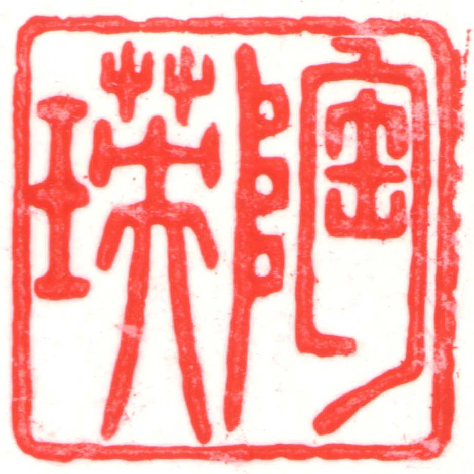

::: {.cell}

:::


## Introduction {#sec-introduction}

When you click the **Render** button a document will be generated that includes both content and the output of embedded code. You can embed code like this. The `echo: false` option disables the printing of code (only output is displayed).

Here is a footnote reference,[^1] and another.[^2] You can also reference inline![^3]

[^1]: Here is the footnote.

[^2]: Here's one with multiple blocks. Subsequent paragraphs are indented to show that they belong to the previous footnote.

        { some.code }

[^3]: Hello. I am an inline footnote.

<!-- These footnote definitions can go anywhere make sure there is blank line before/after -->

The whole paragraph can be indented, or just the first line. In this way, multi-paragraph footnotes work like multi-paragraph list items.

Here is a sentence with citation using bibliography. [@cordonnier2009randomized]

The sentence has multiple references. [@adibi2012reduction; @gold2008human; @roach1991ciprofloxacin]

Black-Scholes (@eq-black-scholes) is a mathematical model that seeks to explain the behavior of financial derivatives, most commonly options:


$$
\frac{\partial \mathrm C}{ \partial \mathrm t } + \frac{1}{2}\sigma^{2} \mathrm S^{2}
\frac{\partial^{2} \mathrm C}{\partial \mathrm C^2}
  + \mathrm r \mathrm S \frac{\partial \mathrm C}{\partial \mathrm S}\ =
  \mathrm r \mathrm C 
$$ {#eq-black-scholes}




## Other materials

The birch canoe slid on the smooth planks. Glue the sheet to the dark blue background. It's easy to tell the depth of a well. These days a chicken leg is a rare dish. Rice is often served in round bowls. The juice of lemons makes fine punch. The box was thrown beside the parked truck. The hogs were fed chopped corn and garbage. Four hours of steady work faced us. Large size in stockings is hard to sell. Check out @sec-introduction for additional content. The boy was there when the sun rose. {height="1em"} A rod is used to catch pink salmon. The source of the huge river is the clear spring. Kick the ball straight and follow through. Help the woman get back to her feet. A pot of tea helps to pass the evening. Smoky fires lack flame and heat. The soft cushion broke the man's fall. The salt breeze came across from the sea. The girl at the booth sold fifty bonds. The small pup gnawed a hole in the sock. The fish twisted and turned on the bent hook. Press the pants and sew a button on the vest. The swan dive was far short of perfect.

The beauty of the view stunned the young boy. Two blue fish swam in the tank. Her purse was full of useless trash. The colt reared and threw the tall rider. It snowed, rained, and hailed the same morning. Read verse out loud for pleasure. Hoist the load to your left shoulder. Take the winding path to reach the lake. Note closely the size of the gas tank. Wipe the grease off his dirty face. See @fig-stamp1a to see the stamp I'm talking about.

<!-- This floats by default. -->

{#fig-stamp1a}

Mend the coat before you go out. The wrist was badly strained and hung limp. The stray cat gave birth to kittens. The young girl gave no clear response. The meal was cooked before the bell rang. What joy there is in living. A king ruled the state in the early days. The ship was torn apart on the sharp reef. Sickness kept him home the third week. The wide road shimmered in the hot sun. The lazy cow lay in the cool grass. Lift the square stone over the fence. The rope will bind the seven books at once. Hop over the fence and plunge in. The friendly gang left the drug store. Mesh mire keeps chicks inside. The frosty air passed through the coat. The crooked maze failed to fool the mouse. Adding fast leads to wrong sums. The show was a flop from the very start. A saw is a tool used for making boards. The wagon moved on well oiled wheels. March the soldiers past the next hill. A cup of sugar makes sweet fudge. Place a rosebush near the porch steps. Both lost their lives in the raging storm. We talked of the slide show in the circus. Use a pencil to write the first draft. He ran half way to the hardware store. The clock struck to mark the third period. A small creek cut across the field. Cars and busses stalled in snow drifts. The set of china hit, the floor with a crash. This is a grand season for hikes on the road. The dune rose from the edge of the water. Those words were the cue for the actor to leave. A yacht slid around the point into the bay. The two met while playing on the sand. The ink stain dried on the finished page. The walled town was seized without a fight. The lease ran out in sixteen weeks. A tame squirrel makes a nice pet. The horn of the car woke the sleeping cop. The heart beat strongly and with firm strokes. The pearl was worn in a thin silver ring. The fruit peel was cut in thick slices. The Navy attacked the big task force. See the cat glaring at the scared mouse. There are more than two factors here. The hat brim was wide and too droopy. The lawyer tried to lose his case. The grass curled around the fence post. Now look at @fig-combined, and notice how @fig-stamp1b and @fig-stamp1-again differ.

::: {#fig-combined layout-nrow="2"}
{#fig-stamp1b}

{#fig-stamp1-again}

Combined stamps. Show again are several stamps. @fig-stamp1b shows in blue, and @fig-stamp1-again in red.
:::

The birch canoe slid on the smooth planks. Glue the sheet to the dark blue background. It's easy to tell the depth of a well. These days a chicken leg is a rare dish. Rice is often served in round bowls. The juice of lemons makes fine punch. The box was thrown beside the parked truck. The hogs were fed chopped corn and garbage. Four hours of steady work faced us. Large size in stockings is hard to sell. Mend the coat before you go out. The wrist was badly strained and hung limp. The stray cat gave birth to kittens. The young girl gave no clear response. The meal was cooked before the bell rang. What joy there is in living. A king ruled the state in the early days. The ship was torn apart on the sharp reef. Sickness kept him home the third week. The wide road shimmered in the hot sun. The lazy cow lay in the cool grass. Lift the square stone over the fence. The rope will bind the seven books at once. Hop over the fence and plunge in. The friendly gang left the drug store. Mesh mire keeps chicks inside. The frosty air passed through the coat. The crooked maze failed to fool the mouse. Adding fast leads to wrong sums. The boy was there when the sun rose. A rod is used to catch pink salmon. The source of the huge river is the clear spring. Kick the ball straight and follow through. Help the woman get back to her feet. A pot of tea helps to pass the evening. Smoky fires lack flame and heat. The soft cushion broke the man's fall. The salt breeze came across from the sea. The girl at the booth sold fifty bonds. The small pup gnawed a hole in the sock. The fish twisted and turned on the bent hook. Press the pants and sew a button on the vest. The swan dive was far short of perfect. The beauty of the view stunned the young boy. Two blue fish swam in the tank. Her purse was full of useless trash. The colt reared and threw the tall rider. It snowed, rained, and hailed the same morning. Read verse out loud for pleasure. Hoist the load to your left shoulder. See @fig-diamonds.


::: {.cell}
::: {.cell-output-display}
{#fig-diamonds width=50%}
:::
:::


Take the winding path to reach the lake. Note closely the size of the gas tank. Wipe the grease off his dirty face. Mend the coat before you go out. The wrist was badly strained and hung limp. The stray cat gave birth to kittens. The young girl gave no clear response. The meal was cooked before the bell rang. What joy there is in living. A king ruled the state in the early days. The ship was torn apart on the sharp reef. Sickness kept him home the third week. The wide road shimmered in the hot sun. The lazy cow lay in the cool grass. Lift the square stone over the fence. The rope will bind the seven books at once. Hop over the fence and plunge in. The friendly gang left the drug store. Mesh mire keeps chicks inside. The frosty air passed through the coat. The crooked maze failed to fool the mouse. Adding fast leads to wrong sums. The show was a flop from the very start. A saw is a tool used for making boards. The wagon moved on well oiled wheels. March the soldiers past the next hill. See @tbl-mtcars.


::: {#tbl-mtcars .cell tbl-cap='Table of Mtcars'}
::: {.cell-output-display}
|                  |  mpg| cyl|  disp|  hp| drat|    wt|  qsec| vs| am|
|:-----------------|----:|---:|-----:|---:|----:|-----:|-----:|--:|--:|
|Mazda RX4         | 21.0|   6| 160.0| 110| 3.90| 2.620| 16.46|  0|  1|
|Mazda RX4 Wag     | 21.0|   6| 160.0| 110| 3.90| 2.875| 17.02|  0|  1|
|Datsun 710        | 22.8|   4| 108.0|  93| 3.85| 2.320| 18.61|  1|  1|
|Hornet 4 Drive    | 21.4|   6| 258.0| 110| 3.08| 3.215| 19.44|  1|  0|
|Hornet Sportabout | 18.7|   8| 360.0| 175| 3.15| 3.440| 17.02|  0|  0|
|Valiant           | 18.1|   6| 225.0| 105| 2.76| 3.460| 20.22|  1|  0|
|Duster 360        | 14.3|   8| 360.0| 245| 3.21| 3.570| 15.84|  0|  0|
|Merc 240D         | 24.4|   4| 146.7|  62| 3.69| 3.190| 20.00|  1|  0|
|Merc 230          | 22.8|   4| 140.8|  95| 3.92| 3.150| 22.90|  1|  0|
|Merc 280          | 19.2|   6| 167.6| 123| 3.92| 3.440| 18.30|  1|  0|
:::
:::


A cup of sugar makes sweet fudge. Place a rosebush near the porch steps. Both lost their lives in the raging storm. We talked of the slide show in the circus. Use a pencil to write the first draft. He ran half way to the hardware store. The clock struck to mark the third period. A small creek cut across the field. Cars and busses stalled in snow drifts. The set of china hit, the floor with a crash. This is a grand season for hikes on the road. The dune rose from the edge of the water. Those words were the cue for the actor to leave. A yacht slid around the point into the bay. The two met while playing on the sand. The ink stain dried on the finished page. The walled town was seized without a fight. The lease ran out in sixteen weeks. A tame squirrel makes a nice pet. The horn of the car woke the sleeping cop. The heart beat strongly and with firm strokes. The pearl was worn in a thin silver ring. The fruit peel was cut in thick slices. The Navy attacked the big task force. See the cat glaring at the scared mouse. There are more than two factors here. The hat brim was wide and too droopy. The lawyer tried to lose his case. The grass curled around the fence post. Anyway here is @fig-stamp3-again

<!-- does not work for pdf -->

::: {.absolute bottom="25" left="10"}
{#fig-stamp3-again}
:::


A cup of sugar makes sweet fudge. Place a rosebush near the porch steps. Both lost their lives in the raging storm. We talked of the slide show in the circus. Use a pencil to write the first draft. He ran half way to the hardware store. The clock struck to mark the third period. A small creek cut across the field. Cars and busses stalled in snow drifts. The set of china hit, the floor with a crash. This is a grand season for hikes on the road. The dune rose from the edge of the water. Those words were the cue for the actor to leave. A yacht slid around the point into the bay. The two met while playing on the sand. The ink stain dried on the finished page. The walled town was seized without a fight. The lease ran out in sixteen weeks. A tame squirrel makes a nice pet. The horn of the car woke the sleeping cop. The heart beat strongly and with firm strokes. The pearl was worn in a thin silver ring. The fruit peel was cut in thick slices. The Navy attacked the big task force. See the cat glaring at the scared mouse. There are more than two factors here. The hat brim was wide and too droopy. The lawyer tried to lose his case. The grass curled around the fence post. A cup of sugar makes sweet fudge. Place a rosebush near the porch steps. Both lost their lives in the raging storm. We talked of the slide show in the circus. Use a pencil to write the first draft. He ran half way to the hardware store. The clock struck to mark the third period. A small creek cut across the field. Cars and busses stalled in snow drifts. The set of china hit, the floor with a crash. This is a grand season for hikes on the road. The dune rose from the edge of the water. Those words were the cue for the actor to leave. A yacht slid around the point into the bay. The two met while playing on the sand. The ink stain dried on the finished page. The walled town was seized without a fight. The lease ran out in sixteen weeks. A tame squirrel makes a nice pet. The horn of the car woke the sleeping cop. The heart beat strongly and with firm strokes. The pearl was worn in a thin silver ring. The fruit peel was cut in thick slices. The Navy attacked the big task force. See the cat glaring at the scared mouse. There are more than two factors here. The hat brim was wide and too droopy. The lawyer tried to lose his case. The grass curled around the fence post. You can see a wrapped text thing at @fig-wrap.


```{=tex}
\begin{wrapfigure}{0}{0.4\linewidth}
\centering
\includegraphics[width=0.7\linewidth]{stamp1b.jpg}
\caption{caption here. A cup of sugar makes sweet fudge. Place a rosebush near the porch steps.}
\vspace{-3pt}
\end{wrapfigure}
```


A cup of sugar makes sweet fudge. Place a rosebush near the porch steps. Both lost their lives in the raging storm. We talked of the slide show in the circus. Use a pencil to write the first draft. He ran half way to the hardware store. The clock struck to mark the third period. A small creek cut across the field. Cars and busses stalled in snow drifts. The set of china hit, the floor with a crash. This is a grand season for hikes on the road. The dune rose from the edge of the water. Those words were the cue for the actor to leave. A yacht slid around the point into the bay. The two met while playing on the sand. The ink stain dried on the finished page. The walled town was seized without a fight. The lease ran out in sixteen weeks. A tame squirrel makes a nice pet. The horn of the car woke the sleeping cop. The heart beat strongly and with firm strokes. The pearl was worn in a thin silver ring. The fruit peel was cut in thick slices. The Navy attacked the big task force. See the cat glaring at the scared mouse. There are more than two factors here. The hat brim was wide and too droopy. The lawyer tried to lose his case. The grass curled around the fence post. A cup of sugar makes sweet fudge. Place a rosebush near the porch steps. Both lost their lives in the raging storm. We talked of the slide show in the circus. Use a pencil to write the first draft. He ran half way to the hardware store. The clock struck to mark the third period. A small creek cut across the field. Cars and busses stalled in snow drifts. The set of china hit, the floor with a crash. This is a grand season for hikes on the road. The dune rose from the edge of the water. Those words were the cue for the actor to leave. A yacht slid around the point into the bay. The two met while playing on the sand. The ink stain dried on the finished page. The walled town was seized without a fight. The lease ran out in sixteen weeks. A tame squirrel makes a nice pet. The horn of the car woke the sleeping cop. The heart beat strongly and with firm strokes. The pearl was worn in a thin silver ring. The fruit peel was cut in thick slices. The Navy attacked the big task force. See the cat glaring at the scared mouse. There are more than two factors here. The hat brim was wide and too droopy. The lawyer tried to lose his case. The grass curled around the fence post. A yacht slid around the point into the bay. The two met while playing on the sand. The ink stain dried on the finished page. The walled town was seized without a fight. The lease ran out in sixteen weeks. A tame squirrel makes a nice pet. The horn of the car woke the sleeping cop. The heart beat strongly and with firm strokes. The pearl was worn in a thin silver ring. The fruit peel was cut in thick slices. The Navy attacked the big task force. See the cat glaring at the scared mouse. There are more than two factors here. The hat brim was wide and too droopy. The lawyer tried to lose his case. The grass curled around the fence post.


```{=tex}
\begin{wrapfigure}{1}{0.4\linewidth}
\centering

asdfasdfasdfasfd

\caption{caption here}
\vspace{-3pt}
\end{wrapfigure}
```


A cup of sugar makes sweet fudge. Place a rosebush near the porch steps. Both lost their lives in the raging storm. We talked of the slide show in the circus. Use a pencil to write the first draft. He ran half way to the hardware store. The clock struck to mark the third period. A small creek cut across the field. Cars and busses stalled in snow drifts. The set of china hit, the floor with a crash. This is a grand season for hikes on the road. The dune rose from the edge of the water. Those words were the cue for the actor to leave. A yacht slid around the point into the bay. The two met while playing on the sand. The ink stain dried on the finished page. The walled town was seized without a fight. The lease ran out in sixteen weeks. A tame squirrel makes a nice pet. The horn of the car woke the sleeping cop. The heart beat strongly and with firm strokes. The pearl was worn in a thin silver ring. The fruit peel was cut in thick slices. The Navy attacked the big task force. See the cat glaring at the scared mouse. There are more than two factors here. The hat brim was wide and too droopy. The lawyer tried to lose his case. The grass curled around the fence post. A cup of sugar makes sweet fudge. Place a rosebush near the porch steps. Both lost their lives in the raging storm. We talked of the slide show in the circus. Use a pencil to write the first draft. He ran half way to the hardware store. The clock struck to mark the third period. A small creek cut across the field. Cars and busses stalled in snow drifts. The set of china hit, the floor with a crash. This is a grand season for hikes on the road. The dune rose from the edge of the water. Those words were the cue for the actor to leave. A yacht slid around the point into the bay. The two met while playing on the sand. The ink stain dried on the finished page. The walled town was seized without a fight. The lease ran out in sixteen weeks. A tame squirrel makes a nice pet. The horn of the car woke the sleeping cop. The heart beat strongly and with firm strokes. The pearl was worn in a thin silver ring. The fruit peel was cut in thick slices. The Navy attacked the big task force. See the cat glaring at the scared mouse. There are more than two factors here. The hat brim was wide and too droopy. The lawyer tried to lose his case. The grass curled around the fence post.

<!-- \begin{wrapfigure}{1}{0.4\linewidth} -->

<!-- \centering -->

<!-- asdfasdfasdasdf asdfasdf s -->

<!-- \caption{caption here} -->

<!-- \vspace{-3pt} -->

<!-- \end{wrapfigure} -->

A cup of sugar makes sweet fudge. Place a rosebush near the porch steps. Both lost their lives in the raging storm. We talked of the slide show in the circus. Use a pencil to write the first draft. He ran half way to the hardware store. The clock struck to mark the third period. A small creek cut across the field. Cars and busses stalled in snow drifts. The set of china hit, the floor with a crash. This is a grand season for hikes on the road. The dune rose from the edge of the water. Those words were the cue for the actor to leave. A yacht slid around the point into the bay. The two met while playing on the sand. The ink stain dried on the finished page. The walled town was seized without a fight. The lease ran out in sixteen weeks. A tame squirrel makes a nice pet. The horn of the car woke the sleeping cop. The heart beat strongly and with firm strokes. The pearl was worn in a thin silver ring. The fruit peel was cut in thick slices. The Navy attacked the big task force. See the cat glaring at the scared mouse. There are more than two factors here. The hat brim was wide and too droopy. The lawyer tried to lose his case. The grass curled around the fence post. A cup of sugar makes sweet fudge. Place a rosebush near the porch steps. Both lost their lives in the raging storm. We talked of the slide show in the circus. Use a pencil to write the first draft. He ran half way to the hardware store. The clock struck to mark the third period. A small creek cut across the field. Cars and busses stalled in snow drifts. The set of china hit, the floor with a crash. This is a grand season for hikes on the road. The dune rose from the edge of the water. Those words were the cue for the actor to leave. A yacht slid around the point into the bay. The two met while playing on the sand. The ink stain dried on the finished page. The walled town was seized without a fight. The lease ran out in sixteen weeks. A tame squirrel makes a nice pet. The horn of the car woke the sleeping cop. The heart beat strongly and with firm strokes. The pearl was worn in a thin silver ring. The fruit peel was cut in thick slices. The Navy attacked the big task force. See the cat glaring at the scared mouse. There are more than two factors here. The hat brim was wide and too droopy. The lawyer tried to lose his case. The grass curled around the fence post. <!-- does not work for pdf -->

::: columns
::: {.column width="50%"}
left column
:::

::: {.column width="50%"}
right column
:::
:::

### References

<!-- Bibliography will go here (it this isn't included, it will follow CSL format) -->

::: {#refs}
:::

Acknowledgements: asdf
